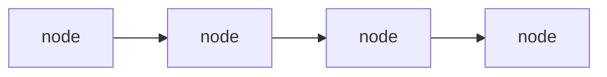
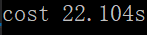
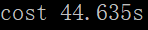

# Searching System实验报告

| 组员   | 分工                                                         |
| ------ | ------------------------------------------------------------ |
| 周寒靖 | 倒排索引、向量空间模型、短语查询、布尔查询、同义词扩展、索引压缩、使用词典索引 |
| 林福煜 | 通配查询、拼写矫正、基于快速评分的Top K查询                  |
| 谢华洋 | 数据测试                                                     |

<div STYLE="page-break-after: always;"></div>

## 操作说明

1、运行整个C++项目

2、等待大概数十秒，直至提示预处理工作结束

2、选择不同的查询指令和对应输入格式(**以分号结尾**)

3、命令台会打印出对应搜索结果

#### 1、布尔查询

查询指令：1			输入格式：操作符为OR/AND/NOT的中缀表达式

```c
例： 1
	COCOA OR shower AND NOT nnn ;
```

#### 2、通配查询

输入指令：2			输入格式：带 * 的不完整单词，* 可以前置、中间、后置，但不能连续两个 *

```c
例： 2
	ne*t*ve ;
```

#### 3、拼写校正

输入命令：3			输入格式

输入样例：

```c
例： 3
	kindom ;
```

#### 4、TOPK查询

输入命令：4			输入格式：所需要的前K个文档和文档ID，空格分隔

```c
例： 4
	10 doc100 ;
```

#### 5、短语查询

输入命令：5			输入格式：短语，每个单词以空格间隔，短语不超过10个单词

```c++
例： 5
    information technology ;
```


#### 6、同义词扩展

1、在``query.txt``中输入需要扩展查询的单词

2、运行``GetSyn.py``获取同义词集合，存在``Synonym.txt``中

3、C++窗口中 输入指令：6			输入格式：需要扩展查询的正确单词，只能1个单词

```c
Query.txt为：
    review
命令窗口为：
    6
    review ;
```


## 实验环境

Windows10

VS2019  debug模式，x64 (**x86不能运行**)


## 文件结构

#### Stemmer.py

对Reuters语料库进行预处理的python源代码，包括去除停用词、去除标点、词形还原等。预处理后的文件存在DataBase文件夹中。

#### DataBase

用nltk库提前对Reuters进行预处理后的语料文件。预处理后的文件都是小写，所以查询时先把用户输入转化成小写，再检索。

#### InvertedIndex.txt

存倒排索引。若把它删了，能重新读取DataBase创建索引；否则直接读取它到内存。

第一行：总文件数  总词数

第二行：所有文件ID和对应总词数，空格分隔。文件之间用|分隔，每个单词之间用#分隔

例：

Argentine
1 10 | 5 5 | 6 5 #            Argentine出现在1号文件第10个位置，5号文件第5个位置，6号文件第5个位置

#### GetSyn.py

调用nltk库对单词进行同义词扩展，把所得同义词存到``Synontm.txt``中

#### Query.txt

输入一个要查询的单词，``GetSyn.py``从这读取，方便后续生成同义词

#### Synonym.txt

存储``GetSyn.py``输出的某个词的同义词


## 功能实现

#### 1、倒排索引

```c++
struct node{
	string WordVal;
	vector<vector<int> > DocList;//vecotr[0]=docID, vector[i]=word's position in doc
	int DocNum;
	struct node* Next;
};
typedef node* WordNode;
WordNode invertIdx;//wordnode's head, first wordnode
```



invertIdx：指向第一个node

每个word信息都由一个node存储。其中

DocNum：该word出现的文件总数

DocList：实则是个二维数组，每个元素vector<int>存文件ID和所在位置，文件ID存在vector[0]

#### 2、词典索引——哈希表

实现“word”->WordNode

用暴雪哈希算法，最大可能降低冲突概率。Hash1, Hash2, Hash3为某word计算得到的哈希值，只有三者相同才能算同一个word，否则顺延填入后续的空位中，三者相同的概率低至$\frac{1}{10^{22}}$。PWord存对应word的倒排索引指针，方便定位到它的docID、pos等性质。

```c++
struct Hashnode{
    unsigned int Hash1;
    unsigned int Hash2;
    unsigned int Hash3;
    WordNode PWord;//倒排索引指针
};
```

#### 3、向量空间模型

```c++
vector<pair<string, double> >* vectorSpace;//docID直接作为数组下标
```

每个文件都对应一个向量，向量中的每个值都是pair<word, wf-idf>。   不存，每次运行后都算出来。

#### 4、K-gram索引

```c++
typedef struct KgramNode {
	string Kgramword;
	struct node* wordList[mx];//There are wordNum words in the kgram
	int wordNum;//total num
	struct KgramNode* Next;
};
typedef KgramNode* TwogramNode;
TwogramNode Kgramhead;//KgramNode's head, first KgramNode
```

本次使用了2-gram索引，每个2-gram词有自己的字符数组wordList[]直接链接struct node。

#### 5、索引压缩

```c++
struct node_com {
	int FirstDoc;//第一个doc ID
	int DocNum_com;
	vector<char> OtherDoc;//其他ID与前一个的差值
	vector<int>* Pos;//words' positions in every doc
};
typedef node_com* WordNode_com;
vector<string> WordVal;//all characters in database
WordNode_com* compressIdx;
```

单词的压缩：把所有单词都存在一个vector<string>里

docID的压缩：每个单词中，存第一个ID、该ID与前一个的差值、对应doc中单词的位置

差值：用$\gamma$编码，存在char里，最多7位，最大可表示的差值为15

单词位置：未进行压缩

#### 6、布尔查询

1、把查询语句变成后缀表达式，把每个单词转变成对应的vector<int> docID。操作符优先级：NOT > AND > OR

2、解析后缀表达式

AND：获取docID1和docID2共有的文档 ID

OR：获取docID1和docID2的并集

NOT：用总文档ID-对应docID

#### 7、通配符查询

首先利用轮排索引去查找相关词项

再对每个词项进行检查把不符合的词项去除

#### 8、拼写矫正

首先利用轮排索引去查找相关词项

再对每个轮排索引进行AND操作找出重复率

最后再对重复率最高的词项再对它计算编辑距离

#### 9、基于快速评分的Top K查询

对每个文件遍序所有词项计算余弦值

再用最大堆输出前K个的文档

#### 10、同义词扩展

1、用python语言，调用nltk库获取对应单词的同义词，存到``Synonym.txt``中。

python代码如下：

```python
from nltk.corpus import wordnet
def main():
    fin=open("./Query.txt","r")
    word=fin.read()
    fin.close()
    print(word)
    if(word=="" or word.find(' ') != -1):
        print("Error!")
        return
    fout=open("./Synonym.txt","w")
    for synSet in wordnet.synsets(word):
        for w in synSet.lemmas():
            fout.write(w.name().lower()+'\n')
    fout.close()
    print("done!")
    
if __name__=='__main__':
    main()
```

2、从``Synonym.txt``中读取所有同义词，再在DataBase中查找出相应同义词

#### 11、短语查询

最多支持有10个单词长的短语

1、若短语只有1个单词，直接作为布尔查询

2、若短语至少2个单词，将前2个单词的文档ID做布尔查询中的“AND”操作，取交集

3、将2所得交集与剩下单词的文档ID依次取交集


## 测试结果

#### 预处理工作耗时

（因电脑系统不同，耗时会有所差异）

生成倒排索引      

读取倒排索引       

整个预处理时间  