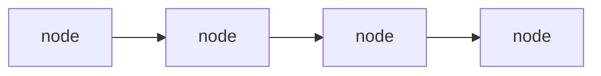
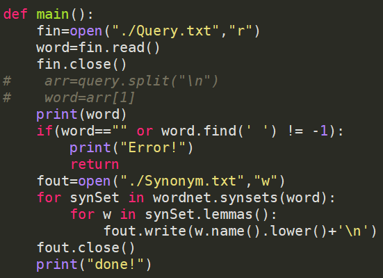
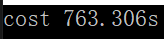
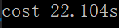

# SearchingSystem

## 环境

Windows10

VS2019  debug模式，x64

## 文件结构

#### Stemmer.py

对Reuters语料库进行预处理的python源代码，包括去除停用词、去除标点、词形还原等。预处理后的文件存在DataBase文件夹中。

#### DataBase

用nltk库提前对Reuters进行预处理后的语料文件。预处理后的文件都是小写，所以查询时先把用户输入转化成小写，再检索。

#### InvertedIndex.txt

存倒排索引。若把它删了，能重新读取DataBase创建索引；否则直接读取它到内存。

第一行：总文件数。

第二行：所有文件ID和对应总词数，空格分隔。比如 1 30 5 20表示1号文件有30词，5号文件有20词

后面：单词+文件ID+单词在该文件的位置。文件之间用|分隔，每个单词之间用#分隔

比如  Argentine
1 10 | 5 5 | 6 5 #            Argentine出现在1号文件第10个位置，5号文件第5个位置，6号文件第5个位置

#### Query.txt

输入一个要查询的单词，GetSyn.py从这读取，方便后续生成同义词

#### Synonym.txt

存储GetSyn.py输出的某个词的同义词

## 功能

bool match：布尔查询

wild match：通配符查询

spelling correct：拼写校正

topK match：topK查询

phrase match：短语查询

synonym match：同义词查询


## 倒排索引

Preprocess.h和Preprocess.cpp里

```c++
struct node{
	string WordVal;
	vector<vector<int> > DocList;//vecotr[0]=docID, vector[i]=word's position in doc
	int DocNum;
	struct node* Next;
};
typedef node* WordNode;
WordNode invertIdx;//wordnode's head, first wordnode
```



invertIdx：指向第一个node

每个word都由一个node存储。其中

DocNum：该word出现的文件总数

DocList：实则是个二维数组，每个元素vector<int>存文件ID和所在位置，文件ID存在vector[0]。比如：

| 文件ID | 所在位置 |
| ------ | -------- |
| 1      | 1,2      |
| 5      | 3,10     |
| 6      | 4        |


## 词典索引

实现“word”->WordNode

用暴雪哈希算法，最大可能降低冲突概率。Hash1, Hash2, Hash3为某word计算得到的哈希值，只有三者相同才能算同一个word，否则顺延填入后续的空位中。PWord存对应word的倒排索引指针，方便定位到它的docID、pos等性质。

```c++
struct Hashnode{
    unsigned int Hash1;
    unsigned int Hash2;
    unsigned int Hash3;
    WordNode PWord;//倒排索引指针
};
```


## 向量空间模型

Preprocess.h和Preprocess.cpp里

```c++
vector<pair<string, double> >* vectorSpace;//docID直接作为数组下标
```

每个文件都对应一个向量，向量中的每个值都是pair<word, wf-idf>

不存，每次运行后都算出来。


## K-gram索引

Preprocess.h和Preprocess.cpp里

```c++
typedef struct KgramNode {
	string Kgramword;
	struct node* wordList[mx];//There are wordNum words in the kgram
	int wordNum;//total num
	struct KgramNode* Next;
};
typedef KgramNode* TwogramNode;
TwogramNode Kgramhead;//KgramNode's head, first KgramNode
```

本次使用了2-gram索引，每个2-gram词有自己的字符数组wordList[]直接链接struct node。


## 索引压缩

CompressIndex.h里

```c++
struct node_com {
	int FirstDoc;//第一个doc ID
	int DocNum_com;
	vector<char> OtherDoc;//其他ID与前一个的差值
	vector<int>* Pos;//words' positions in every doc
};
typedef node_com* WordNode_com;
vector<string> WordVal;//all characters in database
WordNode_com* compressIdx;
```

单词的压缩：把所有单词都存在一个vector<string>里

docID的压缩：每个单词中，存第一个ID、该ID与前一个的差值、对应doc中单词的位置

差值：用$\gamma$编码，存在char里，最多7位，最大可表示的差值为15

单词位置未进行压缩


## 布尔查询

#### 原理

1、把查询语句变成后缀表达式，把每个单词转变成对应的vector<int> docID。操作符优先级：NOT > AND > OR

2、解析后缀表达式

AND：获取docID1和docID2共有的文档 ID

OR：获取docID1和docID2的交集

NOT：用总文档ID-对应docID

#### 输入

操作符有：OR、AND、NOT（全大写）

输入样例：

```c
1
COCOA OR shower AND NOT nnn
```


## 通配符查询

#### 输入

操作符有：*

输入样例：

```c
2
ne*t*ve
```

首先利用轮排索引去查找相关词项

再对每个词项进行检查把不符合的词项去除


## 拼写矫正

#### 输入

在Query.txt输入命令+需要矫正的单词

输入样例：

```c
3
coen
```

首先利用轮排索引去查找相关词项

再对每个轮排索引进行AND操作找出重复率

最后再对重复率最高的词项再对它计算编辑距离


## 基于快速评分的Top K查询

#### 输入

在Query.txt输入命令+所需要的前K个文档和"doc"輸入文档数字

输入样例：

```c
4
10 doc100
```

对每个文件遍序所有词项计算余弦值

再用最大堆输出前K个的文档


## 同义词扩展

#### 原理

用nltk库获取对应单词的同义词

```python
from nltk.corpus import wordnet
```



#### 输入

输入需要扩展的单词

输入样例：

```c
review
```

#### 运行

先运行``GetSyn.py``获取同义词集合，存在``Synonym.txt``中。再运行C++代码进行查询/输出同义词(组)


## 耗时

生成倒排索引      

读取倒排索引       

